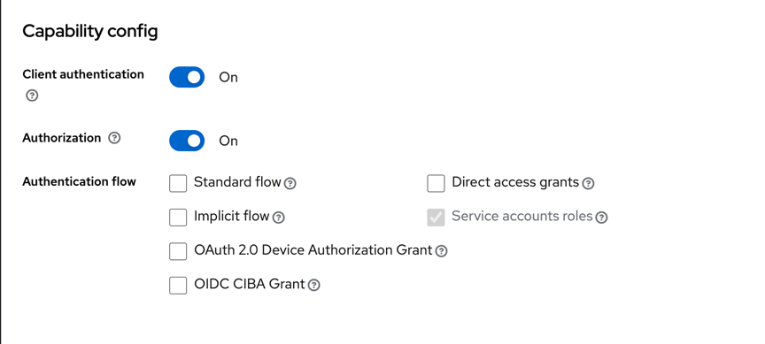
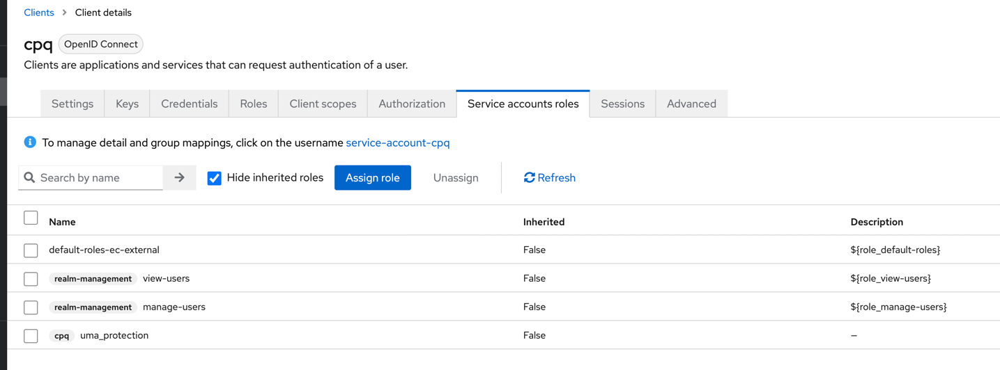
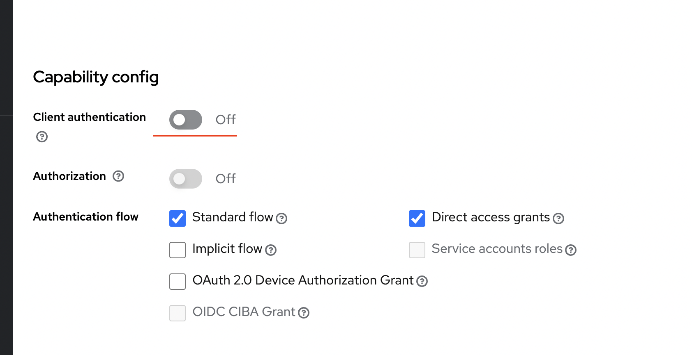

# Работа с keycloak из react/next.js/quarkus
https://www.youtube.com/watch?v=j0oIguIa0r0&list=PLQZfys2xO5kgpa9-qpJly78d-t7_Fnjec&index=5

### start
docker-compose up --build (--build - всегда пересобирать images)

- запустить postgresql локально
  brew services start postgresql

- остановить postgresql локально
brew services stop postgresql

http://localhost:80/ - тут фронт
http://localhost:3000/ - тут бек node
http://localhost:5432/ - тут db
https://localhost:8443/admin - тут keycloak

### кейклок контейнер https://www.keycloak.org/server/containers

Keycloak starts in production mode, using only secured HTTPS communication, and is available on https://localhost:8443.

Health check endpoints are available at https://localhost:8443/health, https://localhost:8443/health/ready and https://localhost:8443/health/live.

Opening up https://localhost:8443/metrics leads to a page containing operational metrics that could be used by your monitoring solution.

### docker volume prune
https://github.com/docker-library/postgres/issues/453
docker volume prune

когда работаю с бд обязательно запускаю docker volume prune для очистки volume у дб

### чтобы создать сертификат для localhost
https://letsencrypt.org/docs/certificates-for-localhost/

crt и key -> pem
и далее в 
https://www.keycloak.org/server/enabletls ищу раздел Providing certificates in PEM format

### realm 
В контексте Keycloak, "realm" (дословно "царство" или "область") представляет собой изолированное пространство для управления учетными записями, аутентификации и авторизации. Realm может быть представлен как отдельное приложение или сервис, имеющее свои собственные наборы пользователей, клиентов (клиентские приложения) и конфигурацию безопасности.

Когда вы используете Keycloak, вы создаете realm для вашего приложения или сервиса. Внутри этого realm вы можете определять пользователей, их роли, настраивать параметры аутентификации и авторизации, а также настраивать клиентские приложения, которые имеют доступ к вашему realm.

Realm обеспечивает изоляцию данных и настроек между разными приложениями или сервисами, что делает его мощным инструментом для управления безопасностью в различных контекстах вашего приложения или организации.

### client
В Keycloak термин "client" обозначает любое приложение или сервис, которое обращается к серверу Keycloak для аутентификации и/или авторизации пользователей. Клиенты в Keycloak могут быть различного типа, включая веб-приложения, мобильные приложения, сервисы API и так далее.

Каждый клиент в Keycloak имеет свои собственные настройки безопасности и конфигурации, такие как:

Идентификатор клиента (Client ID): Уникальный идентификатор, который используется для идентификации клиента при обмене данными с сервером Keycloak.
Секрет клиента (Client Secret): Секретный ключ, используемый для аутентификации клиента при обмене данными с сервером Keycloak.
Роли и разрешения: Клиенты могут иметь свои собственные роли и разрешения, которые могут быть назначены пользователям при авторизации.
Конфигурация протоколов аутентификации: Клиенты могут настраиваться для использования различных протоколов аутентификации, таких как OpenID Connect, SAML и других.
Каждый клиент в Keycloak также может быть настроен для использования различных функций безопасности, таких как SSO (Single Sign-On), множественные области (Realms), ограничение доступа на основе ролей и прочее.
когда создаю клиент не забываю ему проставить Standard flow и Direct access grants (https://oauth.net/2/grant-types/)

### OIDC
Обычно для клиента используют standart flow

OIDC расшифровывается как "OpenID Connect". Это протокол аутентификации, который строится поверх протокола аутентификации OAuth 2.0 и добавляет слой идентификации.

Ключевые особенности OpenID Connect:
**Аутентификация**: Позволяет клиентскому приложению получать информацию об аутентифицированном пользователе.
**Авторизация**: Включает в себя возможность получения разрешений от пользователя на доступ к его личным данным.
**Идентификация**: Предоставляет уникальный идентификатор пользователя, который клиентское приложение может использовать для идентификации пользователя в пределах своей системы.
**Токены**: OpenID Connect определяет три вида токенов: ID Token, Access Token и Refresh Token, которые используются для аутентификации и авторизации.
**Стандартизация**: OpenID Connect основан на стандартах JSON Web Token (JWT), которые обеспечивают безопасную передачу информации между сторонами.
Использование OpenID Connect позволяет разработчикам создавать безопасные и надежные приложения, поддерживающие единый механизм аутентификации и авторизации для пользователей.

Authentication (аутентификация):Пример: При входе в систему пользователь предоставляет учетные данные (логин и пароль), и система проверяет их на соответствие для определения, действительно ли этот пользователь тот, за кого себя выдает.

Authorization (авторизация): Пример: После успешной аутентификации пользователь может иметь различные уровни доступа в зависимости от своей роли или привилегий. Например, администратор может иметь доступ к административным функциям, в то время как обычный пользователь может иметь ограниченный доступ только к основной функциональности приложения.

аутентификация определяет, кто вы, а авторизация определяет, что вы можете делать после того, как система определила вашу подлинность.

OpenID Connect (OIDC) и OAuth 2.0 это два различных протокола, но они часто используются вместе для обеспечения аутентификации и авторизации в веб-приложениях.

OpenID Connect: Целью является добавление слоя аутентификации к протоколу OAuth 2.0. Он предоставляет стандартный способ аутентификации пользователей и предоставления клиентским приложениям информации об аутентифицированных пользователях.
OAuth 2.0: Основная цель - предоставить авторизацию и авторизацию для API, позволяя пользователям предоставлять доступ к своим данным без передачи своих учетных данных.

Оффтопик
SAML (Security Assertion Markup Language) - это стандарт для обмена аутентификационной и авторизационной информацией между безопасными доменами. Он позволяет установить доверительные отношения между поставщиком услуг и идентификационной системой. SSO (Single Sign-On): Одним из ключевых преимуществ SAML является возможность реализации SSO, что позволяет пользователю аутентифицироваться один раз и получить доступ ко всем сервисам без повторной аутентификации.

### распарсить токен
https://jwt.io/

### на юзере нет аттрибутов фикс
https://localhost:8443/admin/master/console/#/ec-external/realm-settings -> включить unmanaged attributes

### в Client scopes создаю скоуп ecom-dedicated с маппером   name: user_id (не забываю Token Claim Name = user_id)
далее на юзере создаю этот атрибут с нужным value и в https://jwt.io/ могу увидеть его - распарсив токен который получу в clients -> account (не забудь добавить ecom-dedicated в client scope)

### далее создаю cpq client с Authentication flow  это важно так как если оставить Standard flow то не смогу забрать токен

[Все апи keycloak](https://www.keycloak.org/docs-api/22.0.1/rest-api/index.html#_users)

для того чтобы cpq клиент мог создавать юзеров должен проставить в Service account roles нужные роли 

### чтобы с UI можно было делать запрос надо отключить в клиенте Client authentication!!!

Client authentication  - это The type of OIDC client.
ON
For server-side clients that perform browser logins and require client secrets when making an Access Token Request. This setting should be used for server-side applications.

OFF
For client-side clients that perform browser logins. As it is not possible to ensure that secrets can be kept safe with client-side clients, it is important to restrict access by configuring correct redirect URIs.
